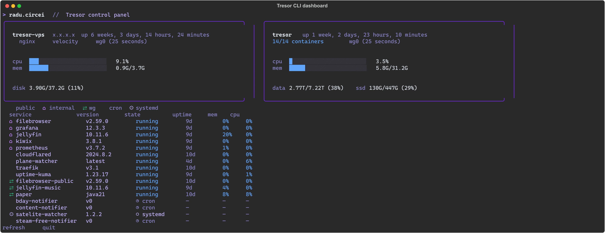
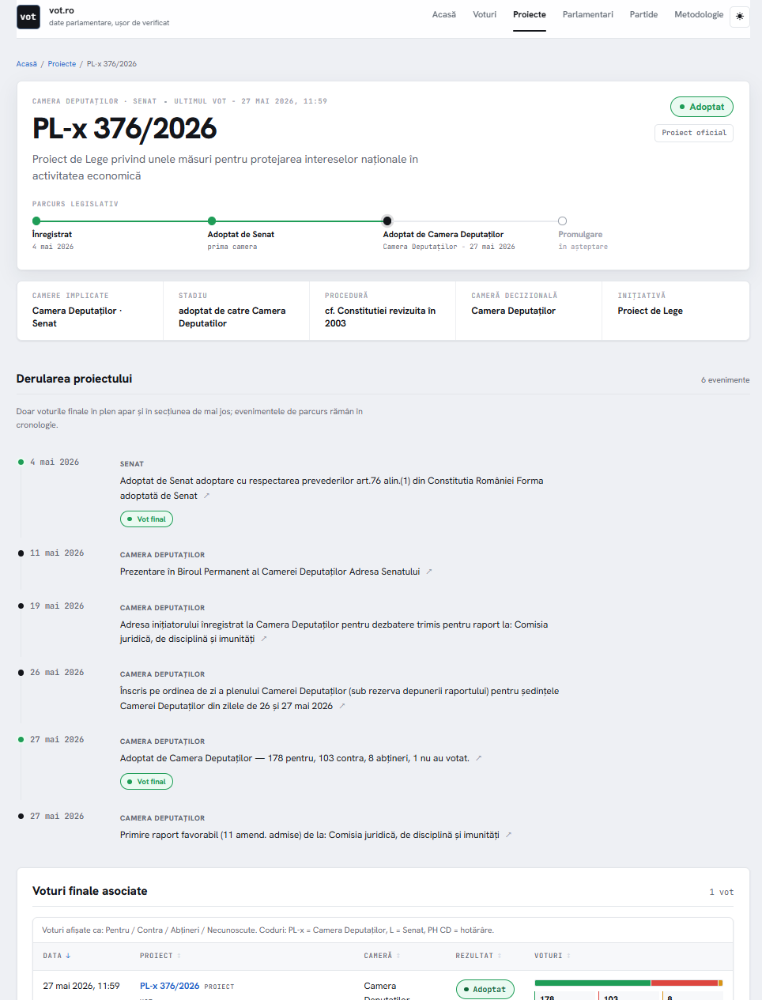
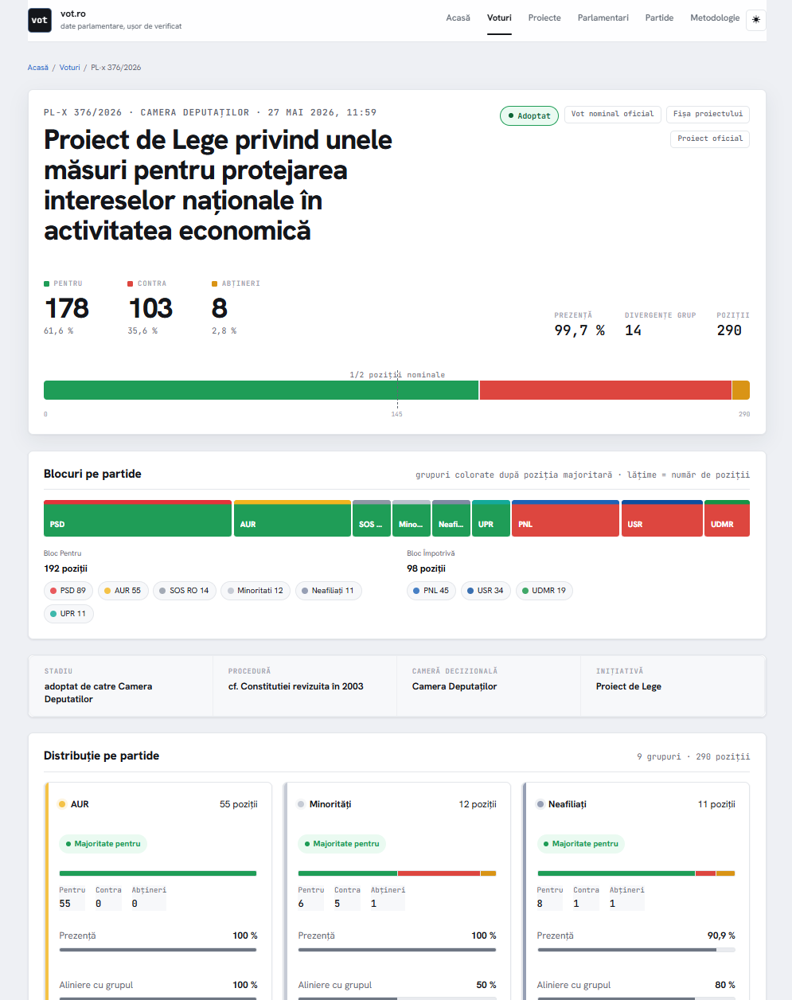
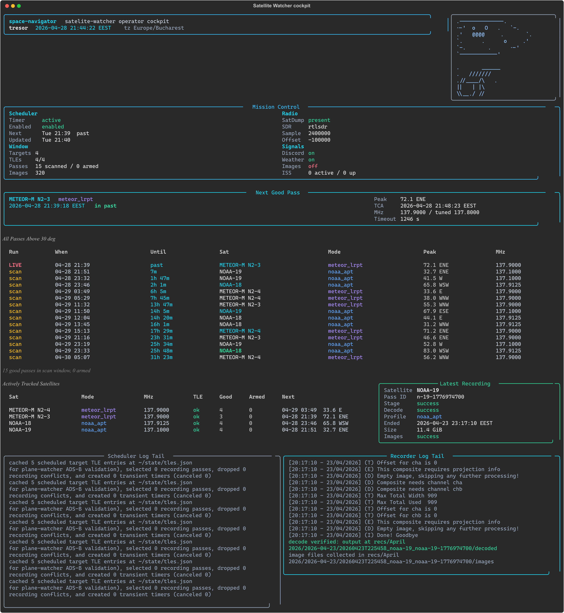
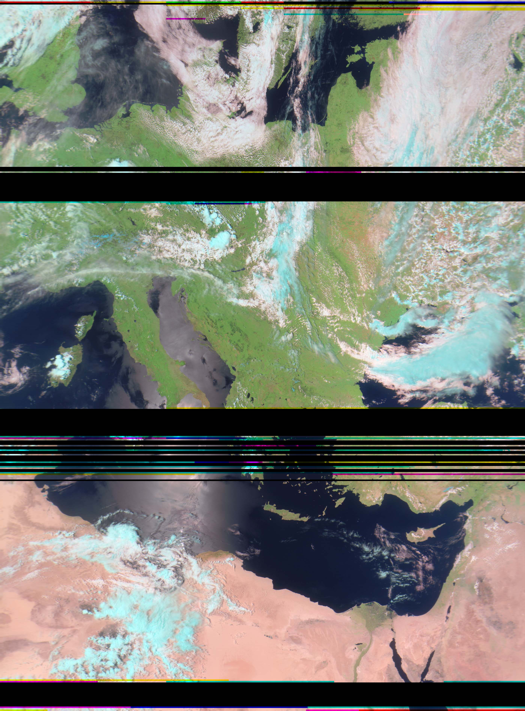
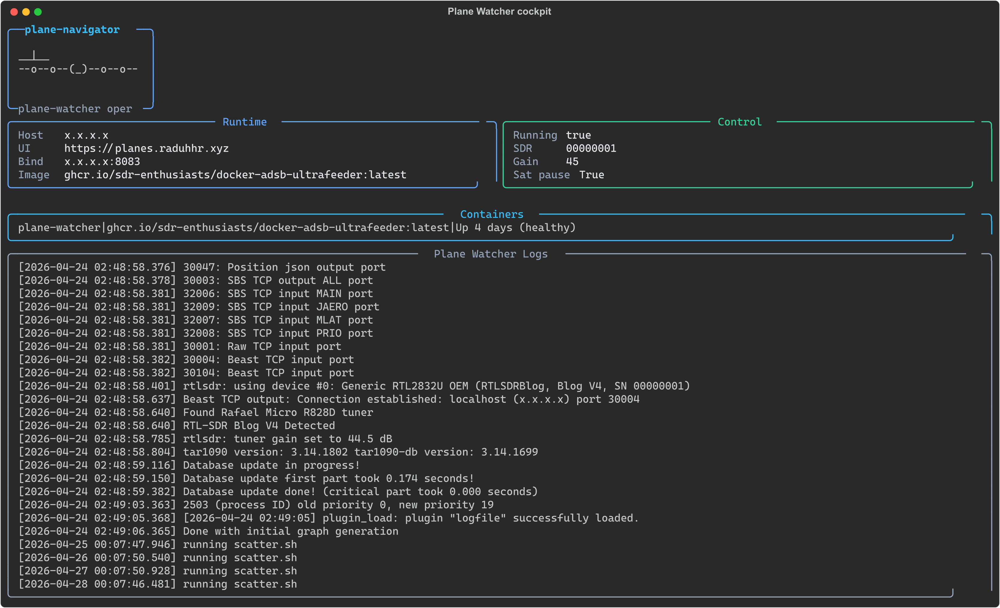
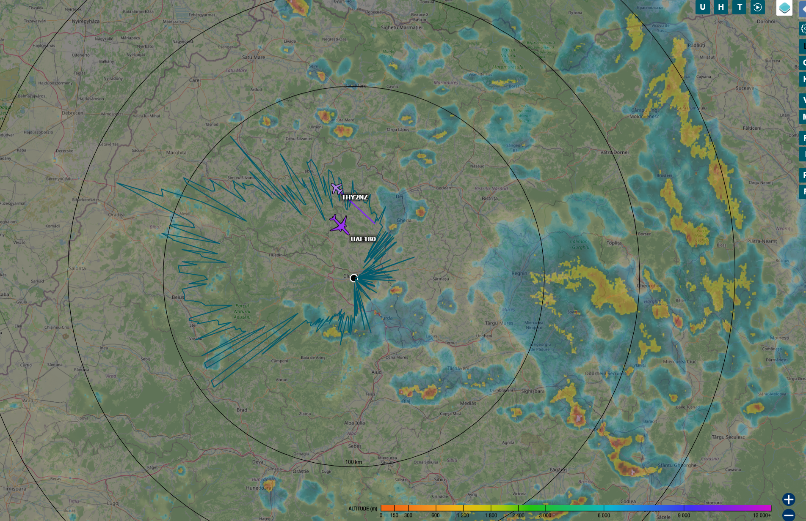
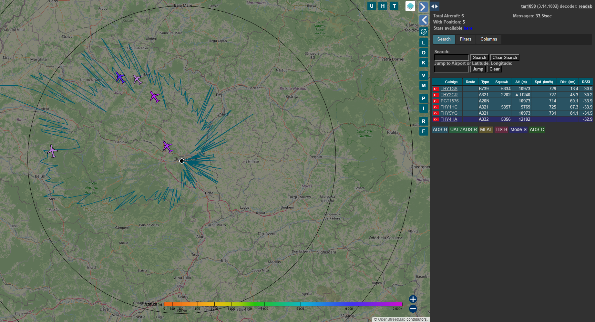
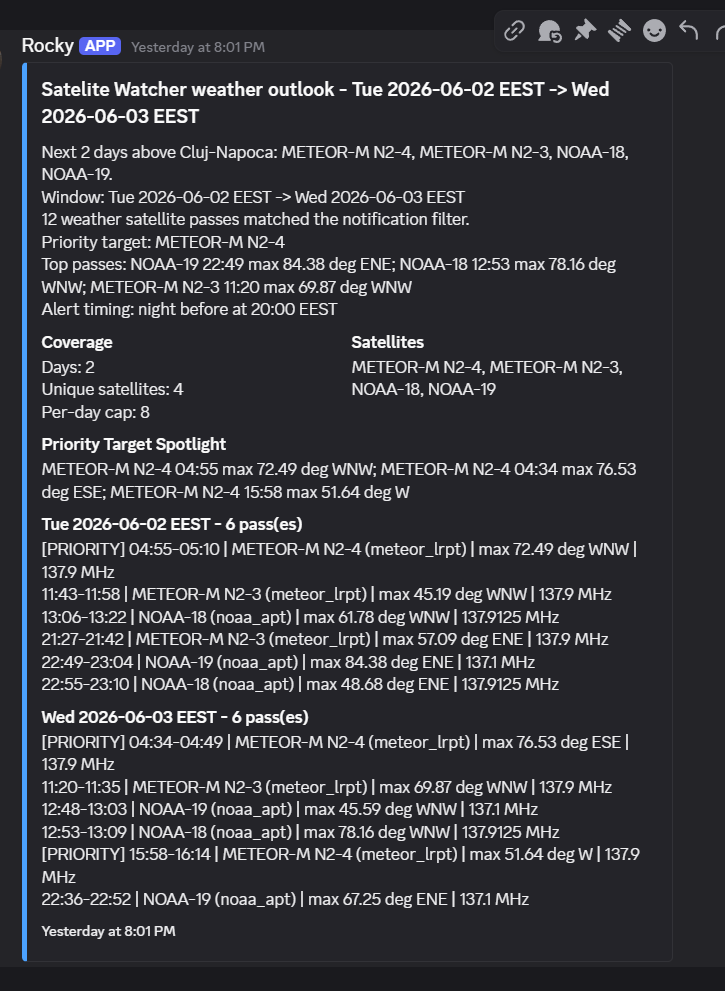
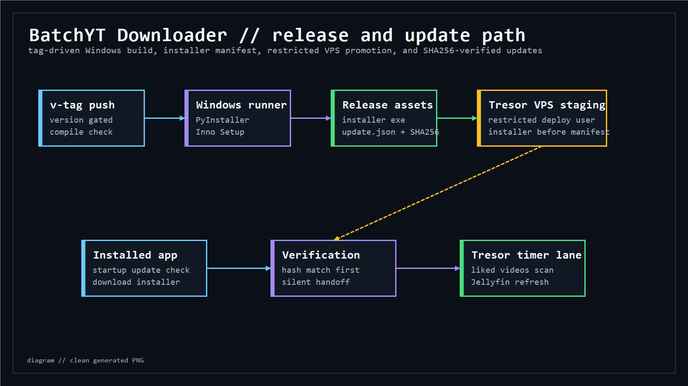

# Tresor Ops Platform

Public, sanitized evidence repo for my personal operations platform: a home
node, QA VM, Hetzner edge VPS, WireGuard private paths, Grafana observability,
radio automation, release/update hosting, and small public products managed
through one Ansible control model.

This is not a runnable clone of the live environment. It keeps the useful code,
operator surfaces, and screenshots, while omitting private inventory, vaults,
host-specific runtime state, database exports, cookies, tokens, and deployment
secrets.


## What This Proves

- Ansible-managed infrastructure with service-specific roles and lifecycle
  playbooks.
- A public/private routing model across Cloudflare Tunnel, VPS nginx, Traefik,
  WireGuard, Docker networks, and LAN-only monitoring.
- Terminal operator cockpits for service inventory, Grafana, infrastructure,
  plane watcher, satellite watcher, and Tresor Index work.
- Grafana and Prometheus evidence for host health, containers, Minecraft,
  ingestion jobs, and read-only data dashboards.
- Newer lanes that were missing from the old public repo: Tresor Index,
  BatchYT update hosting, plane watcher, satellite watcher, paper join
  notifier, RA artist notifier, and vot-parlament.ro deployment support.

## Included Code

The `ansible/` directory includes current sanitized roles, playbooks, and
operator scripts:

| Area | Included surfaces |
| --- | --- |
| Core platform | base, Docker, Docker firewall, networks, WireGuard client/server |
| Edge routing | Cloudflared, Traefik, nginx, Velocity, static site/update vhosts |
| Observability | Grafana, Prometheus, Uptime Kuma, Minecraft metrics |
| Private apps | Jellyfin, Jellyfin Music, FileBrowser, Kiwix |
| Data/products | Tresor Index, vot-parlament.ro deploy support, BatchYT update deploy |
| Radio | ADS-B plane watcher, Meteor satellite watcher, SatDump tooling |
| Utilities | birthday notifier, Steam/free-game notifier, RA artist notifier, Paper join notifier |
| Operators | `tresor-cli.py`, `plane-navigator.py`, `space-navigator.py`, `tresor-index-cli.py` |

## Intentionally Omitted

The public repo excludes anything that would make the live environment
operable by a stranger:

- `ansible/inventory/`
- `ansible/vaults/`
- `.env` files
- Ansible Vault payloads
- Cloudflare tokens, Discord webhooks, API keys, cookies, SSH keys, WireGuard
  private material, database passwords, and R2 credentials
- Generated runtime exports and private database snapshots

Use `examples/` for inert placeholder inventory and variable shapes.

## Platform Model

Tresor uses one source-of-truth repo to manage three execution zones.

| Zone | Purpose | Public exposure |
| --- | --- | --- |
| Home node | Docker workloads, monitoring, data products, radio services | Mostly LAN/WireGuard only |
| QA VM | Role and deployment rehearsal | Private |
| VPS edge | Public ingress, WireGuard server, nginx, Velocity, update hosting | Public edge only |

Public traffic enters through controlled paths:

- Cloudflare Tunnel to Traefik for selected HTTP services.
- VPS nginx to WireGuard-bound services for media, cloud, site, update, and
  civic product paths.
- Velocity TCP edge to Paper over WireGuard for Minecraft.

Monitoring, data ingestion, Grafana, Prometheus, databases, and most service
APIs stay private by design.

## Proof Gallery

The images below are the same safe evidence set used by the portfolio site.

### Control Plane




<details>
<summary>More operator views</summary>


</details>

### Grafana And Runtime Health


<details>
<summary>More Grafana dashboards</summary>


</details>

### Tresor Index And vot-parlament.ro

Tresor Index is the archive layer for sources that would otherwise become
one-off scripts. It powers internal dashboards and the private API bridge used
by [vot-parlament.ro](https://vot-parlament.ro/).


<details>
<summary>Tresor Index dashboards and civic product evidence</summary>







</details>

### Radio Watcher

The radio lane shares an RTL-SDR between live ADS-B aircraft tracking and
scheduled weather-satellite capture. The satellite image is a real Meteor M2-4
pass captured from space.





<details>
<summary>Plane watcher and notification evidence</summary>









</details>

### BatchYT Update Lane

BatchYT is a separate app, but part of its release/update path now lives on
Tresor: a restricted VPS update bucket, installer promotion, update manifest,
and SHA256-verified client checks.




<details>
<summary>BatchYT release and automation proof</summary>


</details>

### Utility Notifications

Small Discord-facing automations still get service users, timers, logs,
secrets, status playbooks, and recovery paths through Tresor.


<details>
<summary>More utility notification proof</summary>


</details>

## Docs

- [Architecture](docs/architecture.md)
- [Operations](docs/operations.md)
- [Sanitization](docs/sanitization.md)

## Validation

Run the local scan before publishing changes:

```bash
scripts/sanity.sh
```

The scan is intentionally conservative. Review any hit manually before pushing
to the public remote.
