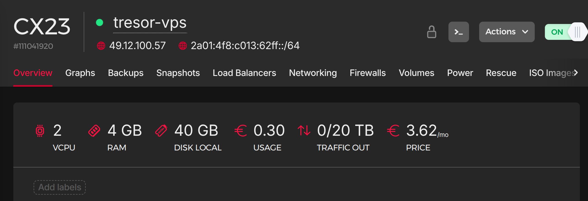
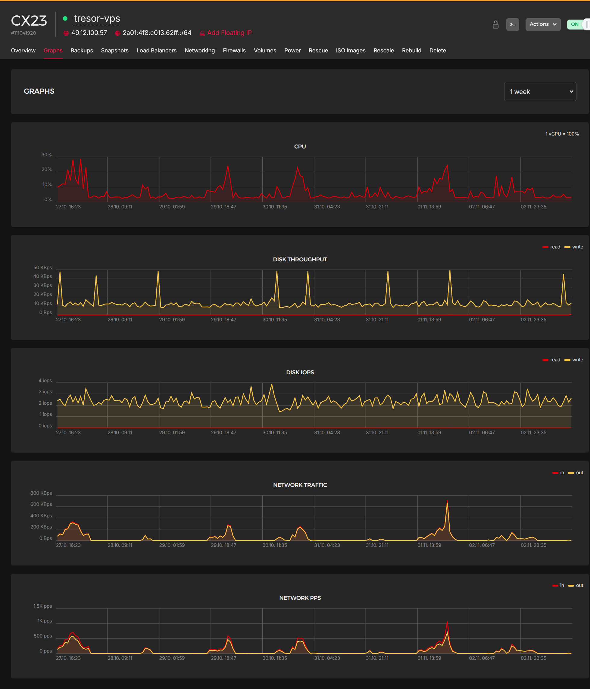

# VPS Setup — tresor-vps (your-vps-provider CX23)

This node serves as **Tresor’s external edge** — a minimal Debian server hosting:

- The **WireGuard server (10.66.66.1)**
    
- The **Velocity Minecraft proxy** (public port 25565)
    
- **Fail2Ban + UFW** for host protection
    

Unlike Tresor, it **does not run Docker** — all services are installed directly via systemd-managed units and handled by Ansible.



* * *

### 1\. VPS Provisioning

**Steps (manual, once):**

1.  Create a new your-vps-provider Cloud instance → Plan **CX23**, region `fsn1-dc14 (Germany)`.
    
2.  Select image: **Debian 13 (trixie)**.
    
3.  Add your SSH key from workstation (for initial access).
    
4.  Disable backups (handled by Ansible snapshot flow later).
    
5.  Boot and confirm SSH access:
    
    ```bash
    ssh root@1.2.3.4
    ```
    

* * *

### 2\. Bootstrap the VPS with `init-tresor-vps.sh`

On your workstation:

```bash
scp scripts/init-tresor-vps.sh root@1.2.3.4:/tmp/
ssh root@1.2.3.4 'bash /tmp/init-tresor-vps.sh'
```

This script:

- Creates `ansible` user with NOPASSWD sudo
    
- Disables root login + password auth
    
- Installs base deps (`sudo python3 rsync curl ufw fail2ban`)
    
- Applies minimal hardening identical to the home node
    

Verify SSH:

```bash
ssh ansible@1.2.3.4
sudo -n true && echo "OK"
```

* * *

### 3\. Run VPS Base Setup via Ansible

Playbook:

```bash
ansible-playbook -i inventory/hosts.ini playbooks/vps/setup-base.yml
```

Tasks:

- Configures system timezone + hostname (`tresor-vps`)
    
- Ensures `ufw` and `fail2ban` active
    
- Closes all inbound ports except `22`, `51820`, `25565`
    
- Installs required system tools
    

* * *

### 4\. Deploy WireGuard Server

Playbook:

```bash
ansible-playbook -i inventory/hosts.ini playbooks/vps/setup-wireguard.yml
```

Tasks:

- Creates `/etc/wireguard/wg0.conf` from template
    
- Assigns IP `10.66.66.1/24`
    
- Enables forwarding + iptables rules
    
- Starts and enables systemd unit
    

Verify:

```bash
ssh ansible@homelab-vps 'sudo wg show'
```

Expected peer: `10.66.66.2 (tresor)` connected.

* * *

### 5\. Deploy Velocity Proxy

Playbook:

```bash
ansible-playbook -i inventory/hosts.ini playbooks/vps/setup-velocity.yml
```

Tasks:

- Installs Velocity in `/opt/velocity`
    
- Deploys templated `velocity.toml` and `servers.toml`
    
- Exposes port `25565/tcp` publicly via UFW
    
- Creates and enables `velocity.service`
    
- Uses forwarding secret synced via Ansible Vault
    

Verify:

```bash
sudo systemctl status velocity
ss -tlnp | grep 25565
```

* * *

### 6\. Validate Connectivity End-to-End

From your local workstation or MC client:

- Ping `10.66.66.1` (WireGuard server)
    
- Ping `10.66.66.2` (Tresor home)
    
- Connect to Minecraft via **`1.2.3.4:25565`** (should tunnel via WG → Paper backend)
    

* * *

### ✅ Final VPS State

| Component | Status | Notes |
| --- | --- | --- |
| **WireGuard Server** | ✅ Active | `10.66.66.1` peer connected |
| **Velocity Proxy** | ✅ Running | forwards traffic to Paper (`10.66.66.2:25565`) |
| **UFW / Fail2Ban** | ✅ Enabled | protects SSH + Velocity port |
| **Docker** | ❌ Not Installed | bare-metal setup |
| **Public exposure** | ✅ 25565/tcp + 80/443 | Velocity (MC) + nginx (music.example.com) |
| **nginx** | ✅ Running | reverse proxy for jellyfin-music over WireGuard |

