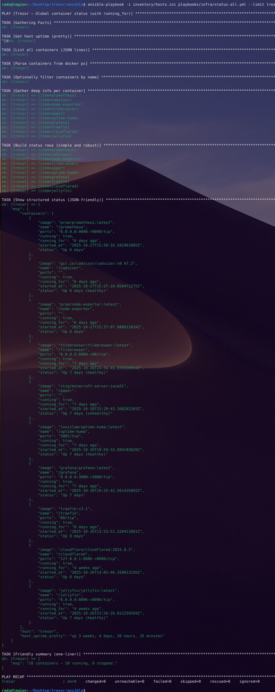

Exact steps, in order, to go from bare **Debian install** → **bootstrap** → **Ansible automation** → **service deployment**.  
Each section gives a short summary and links to the detailed docs/playbooks.  
From **step 2 onward**, all changes are managed only via **Ansible (no manual edits)**.

0\. Static IP assignment

Initial steps before the Debian installation. These are only performed once to prepare for reproducible setup.

**Boot and IP Setup**

- Boot Tresor from the Debian 12 USB stick
- Select **Graphical Install**
- Connect Ethernet when prompted
- Let the installer **auto-configure the network via DHCP**
- Tresor will receive a **temporary IP**
- Pause installation at this step

#### Static IP in Router

- On another device:
    - Open the router’s admin portal
    - Find Tresor in the DHCP client list by MAC address
    - Reserve IP **192.168.1.100** (must be outside DHCP pool)
    - Save changes
    - Reboot Tresor or replug Ethernet to confirm lease is picked up

1\. Debian 12 Graphical install and tresor-vm set-up

Debian 12.11 netinst ISO  
• Prod (Tresor): manual partitioning (SSD /, EFI, /mnt/ssd; HDD /mnt/data), user admin, root login disabled, only SSH server + standard utils installed  
• Result: clean headless systems with SSH enabled, ready for bootstrap with ansible

See [1\. Debian 12 graphical install](../../Tresor/Deployment/1.%20Debian%2012%20Graphical%20install%20%28tresor%29.md)

# 1.1. VM Debian setup (tresor-vm)

See [1.1 VM Debian setup (tresor-vm)](joplin://70657b1bf23846cea4d8c821d3d537bd "/tmp/.mount_Joplin45v6yc/resources/app.asar/%5B1.1%20VM%20Debian%20setup%20%28tresor-vm%29%5D%28../../Tresor/Deployment/1.1%20VM%20Debian%20setup%20%28tresor-vm%29.md%29")

# 1.2. VPS Debian setup (tresor-vps)

your-vps-provider instance, no docker, debian, ufw wg server and a velocity mc proxy service
playbooks/vps/setup-base, setup-wireguard, setup-velocity .yml plays

See [1.2 VPS Debian setup (tresor-vps)](../../Tresor/Deployment/1.2%20VPS%20Debian%20setup%20%28tresor-vps%29.md)

# 2\. Run the initial bootsrap script: init-tresor

Initial bootstrap (init-tresor)  
• Copy init-tresor.sh to /tmp on the target (via scp or USB).  
• Run the script with environment variables:  
• ANSIBLE_PUBKEY → your workstation’s public key  
• SET_HOSTNAME → tresor or tresor-vm  
• ALLOW_USERS → ansible admin (transition, later just ansible)  
• Script actions:  
• Creates ansible user with passwordless sudo  
• Installs minimal deps: sudo, python3, rsync, openssh-server  
• Hardens SSH: disables root login + password auth  
• Verify: log in as ansible with key, run sudo -n true && echo OK, and test ansible -m ping.

See [init-tresor. sh](../../Tresor/Scripts/init-tresor.sh.md)  
 

# 3\. Deploy the Base System (setup-base.yml)

**Purpose:** baseline configuration and hardening for Debian.

Playbook → `playbooks/infra/setup-base.yml`  
Tasks:

- Install core packages (`sudo`, `curl`, `htop`, `fail2ban`, `ufw`, etc.)
    
- Configure SSH (`AllowUsers`, no root login, disable password auth)
    
- Configure timezone, locale, and unattended upgrades
    
- Apply sysctl tweaks (from `roles/base/templates/99-tresor.conf.sysctl.j2`)
    
- Deploy custom `/etc/motd` via the `motd` role
    

Verify:

`ansible-playbook -i inventory/hosts.ini playbooks/infra/verify-base.yml`

&nbsp;

# 4\. Deploy Docker (setup-docker.yml)

Playbook → `playbooks/infra/setup-docker.yml`  
Tasks:

- Install Docker Engine (rootless)
    
- Configure `daemon.json` and cgroup settings
    
- Enable user access for `ansible`
    
- Test Docker socket and version
    

Verify:

`ansible-playbook -i inventory/hosts.ini playbooks/infra/verify-docker.yml`

&nbsp;

# 5\. Create Docker Networks (setup-networks.yml).

Playbook → `playbooks/infra/setup-networks.yml`  
Creates:

- `public_net` → Cloudflare + Traefik
    
- `lan_pub` → LAN web access
    
- `internal_net` → monitoring + media
    
- `mc_pub` → WireGuard bridge
    
- `mc_net` → isolated PaperMC backend
    

Verify:

`ansible-playbook -i inventory/hosts.ini playbooks/infra/verify-networks.yml`

6\. Deploy WireGuard (setup-wireguard.yml)

Playbooks:

- Home → `infra/setup-wireguard.yml` (client 10.66.66.2)
    
- VPS → `vps/setup-wireguard.yml` (server 10.66.66.1)
    

Purpose:

- Bring up the secure tunnel for Minecraft traffic only
    
- Ensure no other networks route over WireGuard
    

Verify:

`ansible-playbook -i inventory/hosts.ini playbooks/infra/verify-wireguard.yml`  
 

7\. Deploy MOTD

Simple visual metadata of the host’s role and last Ansible run.  
Playbook → `playbooks/motd/deploy.yml`.  
  

# 8\. Deploy Cloudflare Tunnel (cloudflared/deploy.yml)

Playbook → `playbooks/cloudflared/deploy.yml`

- Installs `cloudflared` container
    
- Authenticates with token (from Vault)
    
- Registers `public_net` routes for HTTPS
    

Verify:

`ansible-playbook -i inventory/hosts.ini playbooks/cloudflared/status.yml`

&nbsp;

# 9\. Deploy Traefik Reverse Proxy (traefik/deploy.yml)

Playbook → `playbooks/traefik/deploy.yml`

- Deploys Traefik container on `public_net`
    
- Mounts dynamic configs from `roles/traefik/templates/`
    
- Enables Cloudflare → Traefik → Uptime Kuma routing
    
- Adds middlewares: rate-limit, headers, Turnstile
    

&nbsp;

# 10\. Deploy the public_net services

Playbook → `playbooks/uptime-kuma/deploy.yml`  
Deploys Uptime Kuma (public MC status) on `public_net`.

&nbsp;

# 11\. Deploy the internal_net services

Playbooks per service:

`ansible-playbook playbooks/filebrowser/deploy.yml`  
`ansible-playbook playbooks/jellyfin/deploy.yml`

All attach to `internal_net`.  
Verify connectivity via LAN IP: `http://192.168.1.100:<port>`.

&nbsp;

# 12\. Deploy the mc_net services

`ansible-playbook playbooks/paper/deploy.yml`

Traffic path: **Velocity → WireGuard → mc_pub → PaperMC  
 **

Deploy the back-up solution  
`ansible-playbook -i inventory/hosts.ini playbooks/paper/backup.yml`

# 13\. Deploy Monitoring stack

Playbooks (order-sensitive):  
 `ansible-playbook playbooks/prometheus/deploy.yml`   
This one deploys nodeExporter and Cadvisor too.  
 `ansible-playbook playbooks/grafana/deploy.yml`

# 14\. Small status check (/infra/status-all.yml)

Small final check on the status:   
 `ansible-playbook -i inventory/hosts.ini playbooks/infra/status-all.yml --limit tresor`   
 Output:

&nbsp;